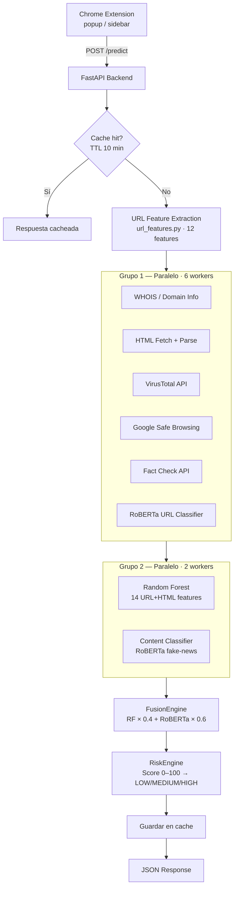
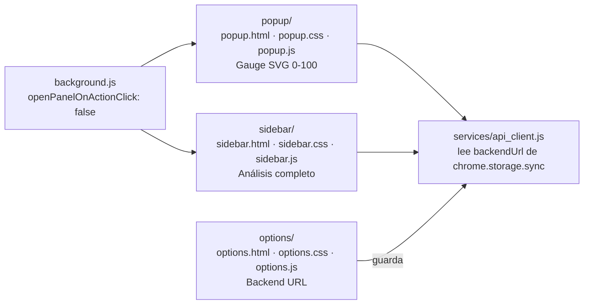

# Arquitectura General

## Visión General

AI Phishing Detector consta de dos componentes principales: un **backend FastAPI** que ejecuta el pipeline de análisis ML y un **Chrome Extension (Manifest V3)** que actúa como interfaz de usuario.

---

## Pipeline de Análisis (`POST /predict`)

El análisis se ejecuta en dos oleadas paralelas y luego una fase secuencial:



### Componentes del pipeline

| Componente | Entrada | Salida |
|---|---|---|
| `url_features.py` | URL string | 12 features (HTTPS, IP, @, subdominios, longitud…) |
| `domain_utils.py` | Dominio | WHOIS: edad, TLD, registrador |
| `html_fetcher.py` + `html_features.py` | URL | HTML parseado + 6 features de página |
| `VirusTotalService` | URL | verdict: clean/suspicious/malicious + stats |
| `SafeBrowsingService` | URL | is_threat + tipos de amenaza |
| `FactCheckService` | Dominio | verdict: reliable/suspicious/unreliable/no_data |
| `RobertaPredictor` | URL string | phishing_probability (0-1) |
| `RandomForestPredictor` | 14 features mapeadas | phishing_probability (0-1) |
| `ContentClassifierService` | Texto de la página | label: REAL/FAKE + confidence |
| `FusionEngine` | RF + RoBERTa URL | phishing_probability combinada |
| `RiskEngine` | Todos los resultados | score 0-100, risk level, reasons[] |

---

## Motor de Riesgo (RiskEngine)

El score parte de **50** y se ajusta de forma aditiva por cada señal. Se limita al rango [0, 100].

| Señal | Penalización / Bonificación |
|---|---|
| HTTPS válido | +10 |
| Sin HTTPS | -20 |
| IP en URL | -30 |
| Símbolo `@` | -40 |
| Subdominios > 2 | -15 |
| URL > 75 chars | -10 |
| Path > 50 chars | -10 |
| Guiones > 3 | -10 |
| ≥ 3 keywords phishing | -9 a -25 |
| Dominio < 30 días | -30 |
| Dominio 30-180 días | -15 |
| Dominio > 1 año | +10 |
| Dominio > 10 años | +20 |
| TLD sospechoso (.xyz, .top…) | -20 |
| TLD confiable (.com, .gov…) | +10 |
| Formulario de contraseña | -15 |
| Sin título / favicon | -5 / -3 |
| JS excesivo (>50) | -10 |
| VirusTotal malicious | -40 |
| VirusTotal suspicious | -20 |
| VirusTotal clean | +10 |
| Safe Browsing dangerous | -50 |
| Safe Browsing suspicious | -25 |
| Fact Check unreliable | -30 |
| Fact Check reliable | +10 |
| Content FAKE (conf ≥ 80%) | -25 |
| Content REAL (conf ≥ 80%) | +10 |
| ML phishing ≥ 85% | -30 |
| ML phishing 65-85% | -15 |
| ML legítimo ≤ 20% | +15 |
| ML legítimo ≤ 35% | +8 |

**Clasificación final:** score ≥ 80 → LOW · score ≥ 50 → MEDIUM · score < 50 → HIGH

---

## Modelos ML

| Archivo | Descripción |
|---|---|
| `models/random_forest_v2.pkl` | RandomForest entrenado con 14 features URL+HTML |
| `models/feature_columns_v2.pkl` | Orden de columnas esperado por el RF |
| `models/roberta_phishing/` | `distilroberta-base` fine-tuned en URLs (strings) |
| `models/roberta_content/` | RoBERTa fine-tuned en `GonzaloA/fake_news`; fallback a `hamzab/roberta-fake-news-classification` si no existe |

### FusionEngine

```
phishing_probability = RF_prob × 0.4 + RoBERTa_URL_prob × 0.6
```

Degradación graceful: si un modelo falla, el otro opera al 100% de peso.

---

## Chrome Extension



| Componente | Función |
|---|---|
| **popup** | Input URL + botón pegar (📋) + gauge animado SVG (score/100) + veredicto |
| **sidebar** | Veredicto completo, barra de score, sección ML, Threat Intel, razones, tab de contenido |
| **options** | Configurar URL del backend (default `http://localhost:8000`) con prueba de conexión |
| **background.js** | Solo registra comportamiento del side panel (icono abre popup, no sidebar) |

---

## Cache

`url_cache.py` implementa un cache TTL thread-safe en memoria:
- TTL: 600 segundos (10 min)
- Máximo: 500 entradas
- Endpoints: `GET /cache/stats` y `DELETE /cache`

---

## Variables de Entorno (`.env`)

```
VIRUSTOTAL_API_KEY=...
SAFE_BROWSING_API_KEY=...
FACT_CHECK_API_KEY=...
```

Cargadas una sola vez en `backend/app/core/config.py` vía `python-dotenv`. Los servicios importan `settings` desde ahí.

---

## Estructura de Módulos

```
backend/app/
  main.py                        FastAPI app, CORS
  core/config.py                 Configuración centralizada (env vars)
  api/routes.py                  Router: POST /predict, POST /analyze-content, GET|DELETE /cache
  services/
    phishing_service.py          Orquesta el pipeline completo
    risk_engine.py               Scorer aditivo 0-100
    content_classifier_service.py  Lazy-loaded vía @lru_cache
    virustotal_service.py
    safe_browsing_service.py
    fact_check_service.py
  ml/fusion/fusion_engine.py     RF×0.4 + RoBERTa×0.6
  random_forest/                 Predictor + model_loader
  roberta/                       Predictor URL + model_loader + trainers
  analyzers/                     html_fetcher, html_features, html_analyzer
  utils/
    url_features.py              12 features de string URL
    domain_utils.py              WHOIS wrapper
    feature_mapper.py            Mapea features → columnas RF
    url_cache.py                 Cache TTL thread-safe
  schemas/
    request_schema.py            UrlRequest (valida http/https), TextRequest
```
