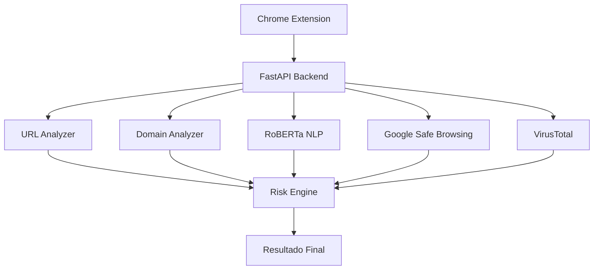

# Arquitectura General

## Componentes Principales

### Chrome Extension

Responsable de:

* Obtener URL actual
* Extraer contenido
* Mostrar resultados

---

### FastAPI Backend

Responsable de:

* Recibir solicitudes
* Coordinar servicios
* Generar respuestas

---

### URL Analyzer

Extrae:

* Longitud URL
* Subdominios
* HTTPS
* Parámetros

---

### Domain Analyzer

Extrae:

* WHOIS
* Edad del dominio
* Fecha de expiración

---

### RoBERTa NLP Engine

Analiza:

* Títulos
* Contenido web
* Formularios

---

### Google Safe Browsing

Detecta:

* Malware
* Phishing
* Ingeniería social

---

### VirusTotal

Consulta:

* Reputación
* Historial de amenazas
* Detecciones antivirus

---

### Risk Engine

Combina todos los resultados y calcula:

* Riesgo
* Confianza
* Evidencias

---

## Diagrama de Arquitectura

