# Motor de Riesgo — Lógica de Puntuación

El `RiskEngine` no usa un árbol de decisiones binario sino un **modelo aditivo**: parte de un score base de 50 y aplica penalizaciones o bonificaciones por cada señal detectada. El resultado final se limita al rango [0, 100].

## Flujo de Clasificación

```mermaid
flowchart TD
    START([Score base: 50]) --> URL

    subgraph URL [Señales de URL]
        U1{HTTPS válido}
        U1 -->|Sí| U1P[+10]
        U1 -->|No| U1N[-20]
        U2{IP en lugar de dominio}
        U2 -->|Sí| U2N[-30]
        U3{Símbolo @ en URL}
        U3 -->|Sí| U3N[-40]
        U4{Subdominios > 2}
        U4 -->|Sí| U4N[-15]
        U5{URL > 75 chars}
        U5 -->|Sí| U5N[-10]
        U6{≥ 3 keywords phishing}
        U6 -->|Sí| U6N[-9 a -25]
    end

    URL --> DOM

    subgraph DOM [Señales de Dominio]
        D1{Edad del dominio}
        D1 -->|< 30 días| D1A[-30]
        D1 -->|30-180 días| D1B[-15]
        D1 -->|> 1 año| D1C[+10]
        D1 -->|> 10 años| D1D[+20]
        D2{TLD sospechoso\n.xyz .top .click}
        D2 -->|Sí| D2N[-20]
        D3{TLD confiable\n.com .gov .edu}
        D3 -->|Sí| D3P[+10]
    end

    DOM --> HTML

    subgraph HTML [Señales HTML]
        H1{Formulario de contraseña}
        H1 -->|Sí| H1N[-15]
        H2{Sin título / sin favicon}
        H2 -->|Sí| H2N[-5 / -3]
        H3{JS excesivo > 50}
        H3 -->|Sí| H3N[-10]
    end

    HTML --> APIS

    subgraph APIS [APIs Externas]
        V1{VirusTotal}
        V1 -->|malicious| V1A[-40]
        V1 -->|suspicious| V1B[-20]
        V1 -->|clean| V1C[+10]
        S1{Safe Browsing}
        S1 -->|MALWARE/PHISHING| S1A[-50]
        S1 -->|otro tipo| S1B[-25]
        F1{Fact Check}
        F1 -->|unreliable| F1A[-30]
        F1 -->|suspicious| F1B[-15]
        F1 -->|reliable| F1C[+10]
    end

    APIS --> ML

    subgraph ML [Señales ML]
        M1{Content Classifier}
        M1 -->|FAKE ≥ 80%| M1A[-25]
        M1 -->|FAKE < 80%| M1B[-10]
        M1 -->|REAL ≥ 80%| M1C[+10]
        M2{Fusion ML\nRF × 0.4 + RoBERTa × 0.6}
        M2 -->|prob ≥ 85%| M2A[-30]
        M2 -->|prob 65-85%| M2B[-15]
        M2 -->|prob ≤ 20%| M2C[+15]
        M2 -->|prob ≤ 35%| M2D[+8]
    end

    ML --> FINAL

    subgraph FINAL [Clasificación Final]
        CLAMP["Clamp: max(0, min(score, 100))"]
        CLAMP --> C1{Score}
        C1 -->|≥ 80| LOW[🟢 LOW — Seguro]
        C1 -->|50-79| MED[🟡 MEDIUM — Sospechoso]
        C1 -->|< 50| HIGH[🔴 HIGH — Peligroso]
    end
```

## Factores de Mayor Peso

| Factor | Impacto |
|---|---|
| Google Safe Browsing detecta amenaza | -50 |
| VirusTotal malicious | -40 |
| Símbolo `@` en URL | -40 |
| ML phishing ≥ 85% | -30 |
| Dominio < 30 días | -30 |
| Fact Check unreliable | -30 |
| IP en lugar de dominio | -30 |

## Factores de Mayor Confianza Positiva

| Factor | Impacto |
|---|---|
| Dominio > 10 años | +20 |
| ML confirma URL legítima (≤ 20%) | +15 |
| HTTPS válido | +10 |
| Dominio > 1 año | +10 |
| TLD confiable | +10 |
| VirusTotal clean | +10 |
| Content REAL ≥ 80% | +10 |
