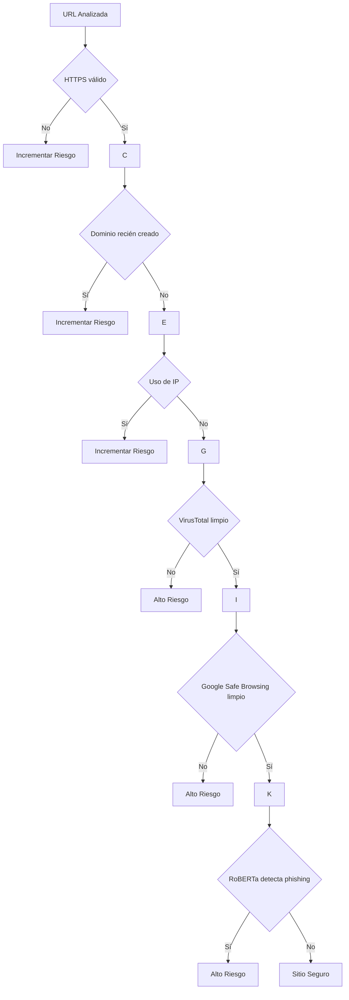

# Árbol de Decisiones de Riesgo

## Factores Positivos

* HTTPS válido
* Dominio antiguo
* Reputación limpia
* Sin formularios sospechosos

## Factores Negativos

* Dominio nuevo
* Formularios de login
* Uso de IP
* Palabras asociadas a phishing
* Reportes de malware
