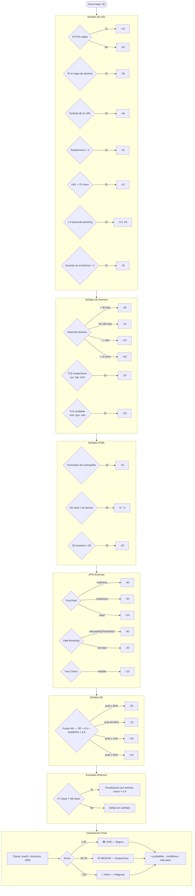

# Motor de Riesgo — Lógica de Puntuación

El `RiskEngine` no usa un árbol de decisiones binario sino un **modelo aditivo**: parte de un score base de 50 y aplica penalizaciones o bonificaciones por cada señal detectada. El resultado final se limita al rango [0, 100].

## Flujo de Clasificación

```mermaid
flowchart TD
    START([Score base: 50]) --> URL

    subgraph URL [Señales de URL]
        U1{HTTPS válido}
        U1 -->|Sí| U1P[+10]
        U1 -->|No| U1N[-20]
        U2{IP en lugar de dominio}
        U2 -->|Sí| U2N[-30]
        U3{Símbolo @ en URL}
        U3 -->|Sí| U3N[-40]
        U4{Subdominios > 2}
        U4 -->|Sí| U4N[-15]
        U5{URL > 75 chars}
        U5 -->|Sí| U5N[-10]
        U6{≥ 3 keywords phishing}
        U6 -->|Sí| U6N[-9 a -25]
        U7{"Guiones en el dominio > 2"}
        U7 -->|Sí| U7N[-10]
    end

    URL --> DOM

    subgraph DOM [Señales de Dominio]
        D1{Edad del dominio}
        D1 -->|< 30 días| D1A[-30]
        D1 -->|30-180 días| D1B[-15]
        D1 -->|> 1 año| D1C[+10]
        D1 -->|> 10 años| D1D[+20]
        D2{TLD sospechoso\n.xyz .top .click}
        D2 -->|Sí| D2N[-20]
        D3{TLD confiable\n.com .gov .edu}
        D3 -->|Sí| D3P[+10]
    end

    DOM --> HTML

    subgraph HTML [Señales HTML]
        H1{Formulario de contraseña}
        H1 -->|Sí| H1N[-15]
        H2{Sin título / sin favicon}
        H2 -->|Sí| H2N[-5 / -3]
        H3{JS excesivo > 50}
        H3 -->|Sí| H3N[-10]
    end

    HTML --> APIS

    subgraph APIS [APIs Externas]
        V1{VirusTotal}
        V1 -->|malicious| V1A[-40]
        V1 -->|suspicious| V1B[-20]
        V1 -->|clean| V1C[+10]
        S1{Safe Browsing}
        S1 -->|MALWARE/PHISHING| S1A[-50]
        S1 -->|otro tipo| S1B[-25]
        F1{Fact Check}
        F1 -->|reliable| F1C[+10]
    end

    APIS --> ML

    subgraph ML [Señales ML]
        M2{"Fusion ML — RF × 0.4 + RoBERTa × 0.6"}
        M2 -->|prob ≥ 85%| M2A[-35]
        M2 -->|prob 65-85%| M2B[-15]
        M2 -->|prob ≤ 15%| M2C[+20]
        M2 -->|prob ≤ 35%| M2D[+10]
    end

    ML --> DAMP

    subgraph DAMP [Escalado dinámico]
        G1{"VT clean Y SB clean"}
        G1 -->|Sí| G1A["Penalización por dominio nuevo × 0.4"]
        G1 -->|No| G1B[Deltas sin cambios]
    end

    DAMP --> FINAL

    subgraph FINAL [Clasificación Final]
        CLAMP["Clamp: max(0, min(score, 100))"]
        CLAMP --> C1{Score}
        C1 -->|≥ 80| LOW[🟢 LOW — Seguro]
        C1 -->|50-79| MED[🟡 MEDIUM — Sospechoso]
        C1 -->|< 50| HIGH[🔴 HIGH — Peligroso]
        LOW --> CAL["+ probability · confidence · intervalos"]
        MED --> CAL
        HIGH --> CAL
    end
```

## Factores de Mayor Peso

| Factor | Impacto |
|---|---|
| Google Safe Browsing detecta amenaza | -50 |
| VirusTotal malicious | -40 |
| Símbolo `@` en URL | -40 |
| ML phishing ≥ 85% | -35 |
| Dominio < 30 días | -30 |
| IP en lugar de dominio | -30 |
| Suplantación de marca en subdominio | -30 |

## Factores de Mayor Confianza Positiva

| Factor | Impacto |
|---|---|
| Dominio > 10 años | +20 |
| ML confirma URL legítima (≤ 15%) | +20 |
| Marca verificada (`google.com`, `paypal.com`, …) | +20 |
| HTTPS válido | +10 |
| Dominio > 1 año | +10 |
| TLD confiable | +10 |
| VirusTotal clean | +10 |
| Fact Check reliable | +10 |

> El Fact Check **sólo suma**: no existe penalización por `unreliable`.
> El clasificador de contenido **no participa** en el score de `/predict`
> (`content_classification` siempre viaja como `null`); vive únicamente en
> el endpoint `/analyze-content`.

## Escalado dinámico

Los deltas no siempre se aplican con su valor nominal. La penalización por
dominio nuevo se multiplica por `_YOUNG_DOMAIN_DAMPING` (0.4) cuando
VirusTotal **y** Safe Browsing coinciden en que la URL está limpia: un sitio
legítimo recién registrado comparte esa señal con el phishing, y era la mayor
fuente de falsos positivos. Se atenúa, no se anula, y una amenaza confirmada
nunca la activa.

La penalización por guiones mira sólo el **hostname** (`num_hyphens_domain`,
umbral 2). Contarlos en toda la URL castigaba cualquier noticia con slug largo
y dejaba pasar dominios como `paypal-secure-login-verify.com`.

## Salida calibrada

Además del score, `RiskEngine` devuelve cuánta confianza merece ese score:

| Campo | Significado |
|---|---|
| `score` | 0–100, el veredicto |
| `probability` | 0–1, probabilidad de que sea phishing |
| `probability_interval` | intervalo de confianza de esa probabilidad |
| `confidence` | 0–1, cuánto confiar en este veredicto |
| `score_interval` | rango plausible del score |
| `ml_agreement` | cuánto coinciden Random Forest y RoBERTa |
| `num_signals` | cuántas señales contribuyeron |

La confianza baja cuando los modelos discrepan o hay pocas señales, y se fija
en 1.0 cuando VirusTotal o Safe Browsing confirman la amenaza.
